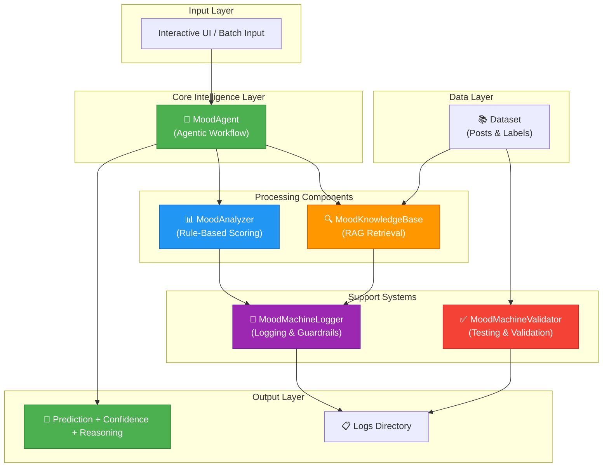
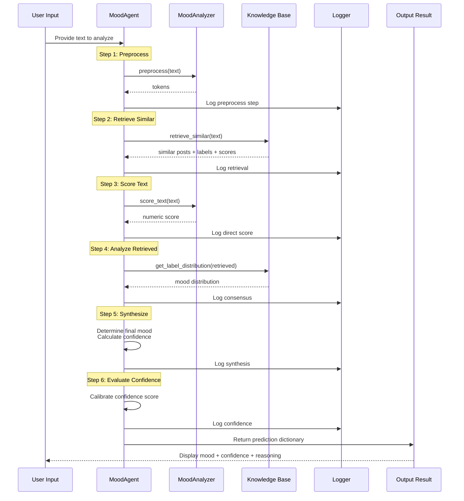
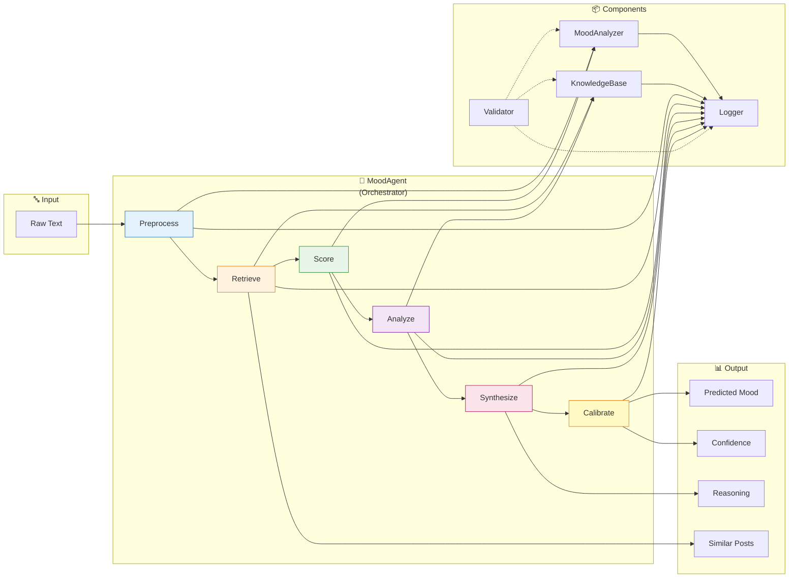
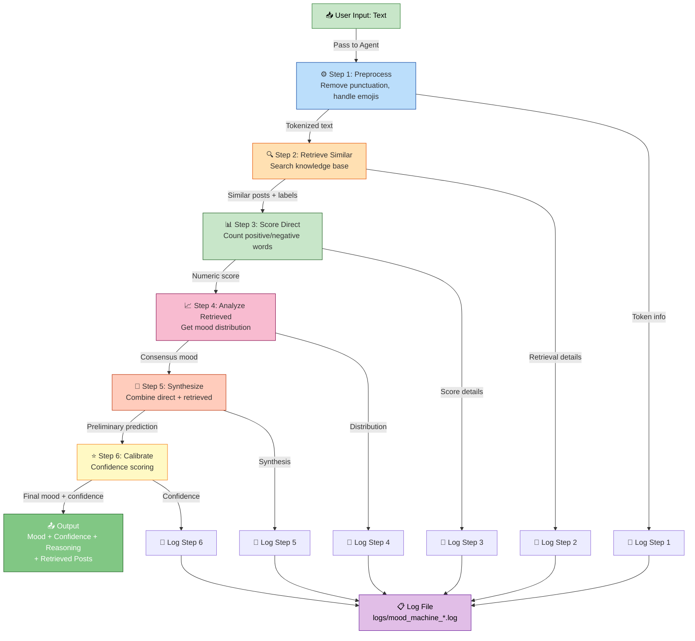
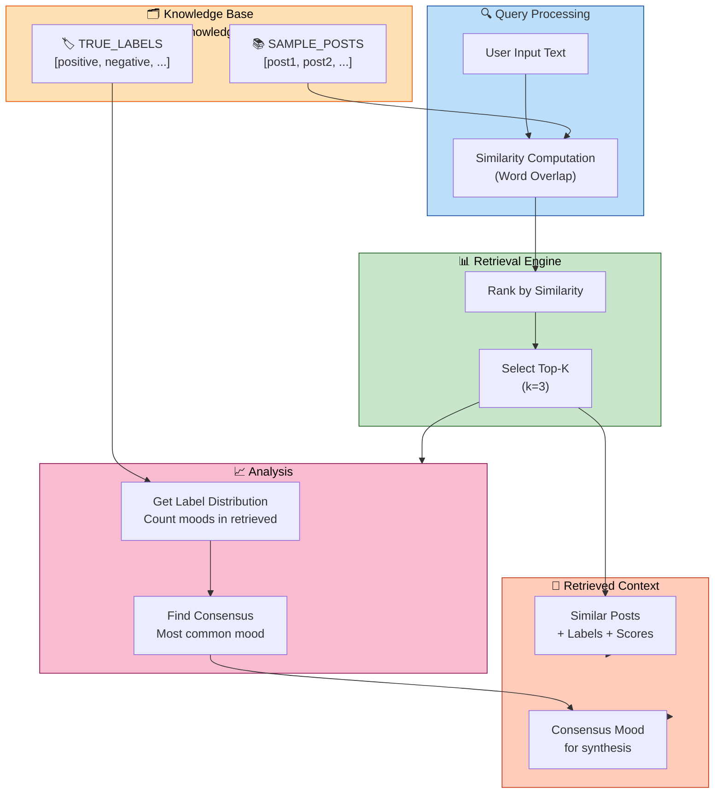
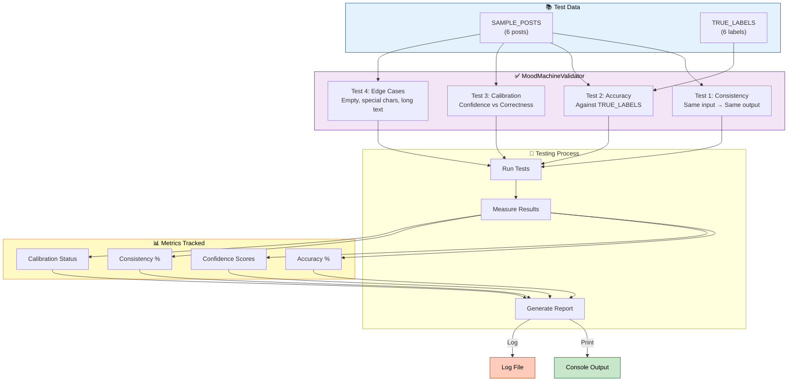
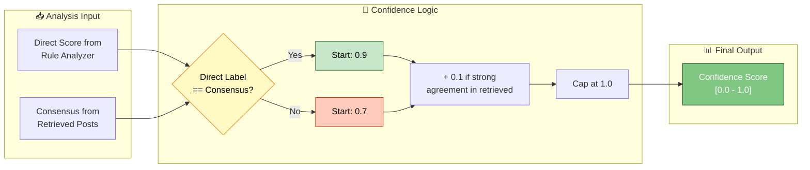
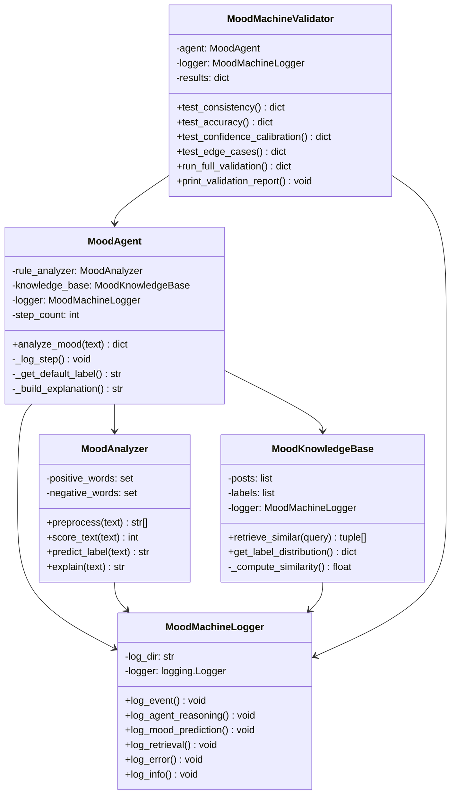

# Advanced Mood Machine - Architecture Diagrams

This file contains Mermaid.js code for system architecture diagrams.
Paste each diagram into https://mermaid.live to generate PNG images for the `/assets` folder.

---

## Diagram 1: System Architecture Overview

---

## Diagram 2: Agentic Workflow - Step-by-Step Reasoning

---

## Diagram 3: Component Interaction Diagram

---

## Diagram 4: Data Flow - From Input to Output

---

## Diagram 5: RAG System Architecture

---

## Diagram 6: Testing & Validation Framework

---

## Diagram 7: Confidence Score Calibration

---

## Diagram 8: Class Diagram - Component Relationships

---

## How to Use These Diagrams

1. **Copy each diagram code** (the `mermaid` block)
2. **Go to** https://mermaid.live
3. **Paste the code** into the editor
4. **Export as PNG** using the download button
5. **Save to** `/assets/` folder with descriptive names:
   - `system_architecture.png`
   - `agentic_workflow.png`
   - `component_interaction.png`
   - `data_flow.png`
   - `rag_system.png`
   - `testing_framework.png`
   - `confidence_calibration.png`
   - `class_diagram.png`

---

## Notes

- Each diagram shows a different perspective of the system
- Colors indicate different functional areas
- Diagrams are designed to be clear and educational
- Use them in your documentation and presentations
