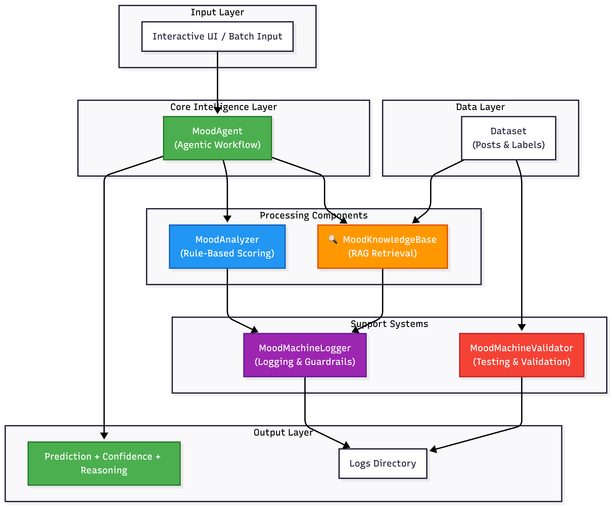
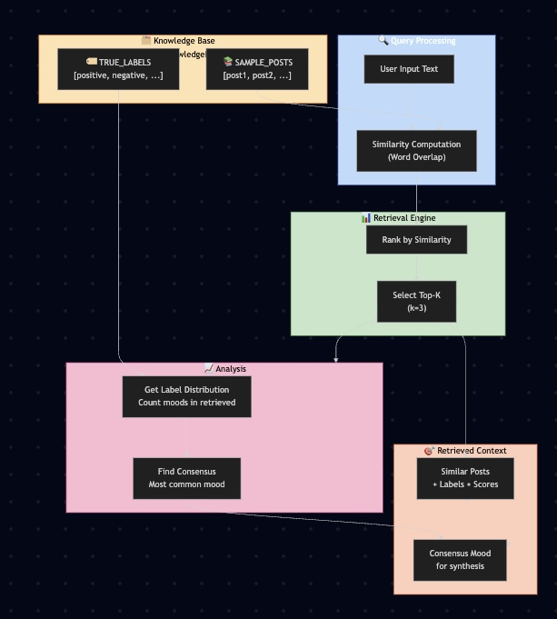
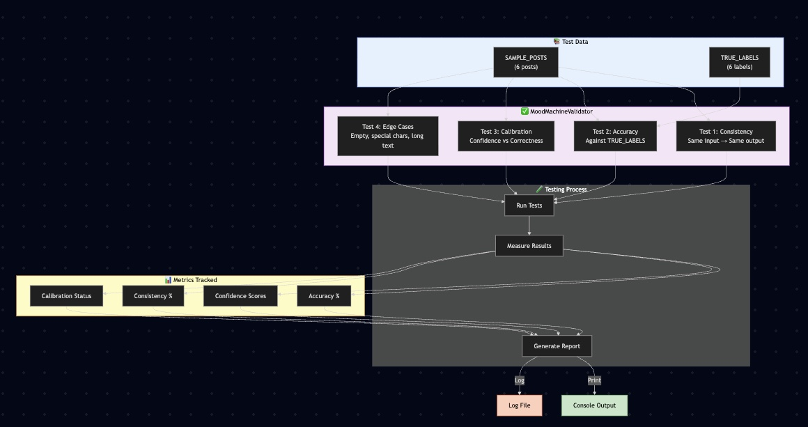

# The Mood Machine (Advanced Submission)

This project is based on the AI110 Module 3 starter repo: `ai110-module3tinker-themoodmachine-starter`.
It extends the original Mood Machine with an **agentic workflow**, **retrieval-augmented reasoning**, **AAVE-aware mood analysis**, **logging**, **validation**, and **system architecture documentation**.

This extension is motivated by the experience of building a mood analyzer as a Black developer who speaks AAVE. The model is designed to better recognize and interpret Black English and vernacular expressions, not just standard sentiment language.

## What this project does

The Advanced Mood Machine analyzes short text and predicts mood labels such as **positive**, **negative**, **neutral**, or **mixed**.
It combines:

- A rule-based sentiment scorer in `mood_analyzer.py` with AAVE slang, phrase normalization, and intensifier handling
- A retrieval system in `retrieval.py` that finds similar examples from the dataset
- An agent orchestrator in `mood_agent.py` that reasons through multiple steps
- A validation suite in `validator.py` to measure consistency, accuracy, and confidence calibration
- A logger in `logger.py` to capture reasoning and errors

## Repo structure

```plaintext
├── assets/                 # Architecture diagrams and demo screenshots
├── dataset.py              # Sample posts, labels, and word lists
├── logger.py               # Central logging and guardrails
├── main.py                 # Entry point with interactive and validation modes
├── mood_agent.py           # Agentic workflow with RAG integration
├── mood_analyzer.py        # Enhanced rule-based scoring model
├── model_card.md           # Reflections, biases, testing, and limitations
├── requirements.txt        # Python dependencies
├── retrieval.py            # Retrieval-Augmented Generation knowledge base
├── test_system.py          # Quick end-to-end verification script
├── validator.py            # Reliability and testing suite
└── README.md               # Project overview and submission guide
```

## Setup and run

1. Open this folder in VS Code.
2. Install dependencies:

```bash
pip install -r requirements.txt
```

3. Run the app:

```bash
python main.py
```

4. Select a mode:

- `1` → Quick evaluation against the sample dataset
- `2` → Batch demo predictions
- `3` → Interactive analysis (type text, or `verbose` for detailed reasoning)
- `4` → Run the validation suite
- Enter nothing to run all modes

## Demo walkthrough

### Example inputs and AI responses

- Input: `I love this class so much` → Prediction: **positive**
- Input: `Today was a terrible day` → Prediction: **negative**
- Input: `Feeling tired but kind of hopeful` → Prediction: **negative**
- Input: `This is fine` → Prediction: **negative**
- Input: `So excited for the weekend` → Prediction: **positive**
- Input: `I am not happy about this` → Prediction: **negative**
- Input: `This party was so lit` → Prediction: **positive**
- Input: `I'm mad salty about that test` → Prediction: **negative**
- Input: `Lowkey stressed but kind of proud of myself` → Prediction: **mixed**

These examples show how the system uses both rule-based scoring and retrieved similar posts to create a final prediction.

### Screenshots

Below are screenshots from the running system and architecture visuals.







## Demo Video

[](https://www.loom.com/share/bfcf956bf92b4300a38dc41b35959653)

https://www.loom.com/share/bfcf956bf92b4300a38dc41b35959653


## Notes on the architecture

The system architecture is stored in `assets/System_architecture.png` and embedded above. The architecture shows how input text flows through the agent, rule-based scoring, retrieval, logging, and output.

## AAVE and cultural motivation

This project intentionally adds support for Black English / AAVE because that language deserves to be understood by AI systems. The model includes explicit normalization for phrases like `no cap` and `periodt`, intensifier detection for terms like `deadass` and `highkey`, and mixed-tone support for terms like `lowkey`.

It is built from the perspective of a developer who uses AAVE, so the system is not just a generic sentiment classifier — it is designed to be more inclusive of culturally grounded expression.

## Additional documentation

- `model_card.md` contains reflection prompts and answers for model behavior, bias, dataset limitations, and testing.
- `assets/` contains architecture and demo images.
- `test_system.py` provides a quick end-to-end verification script.
